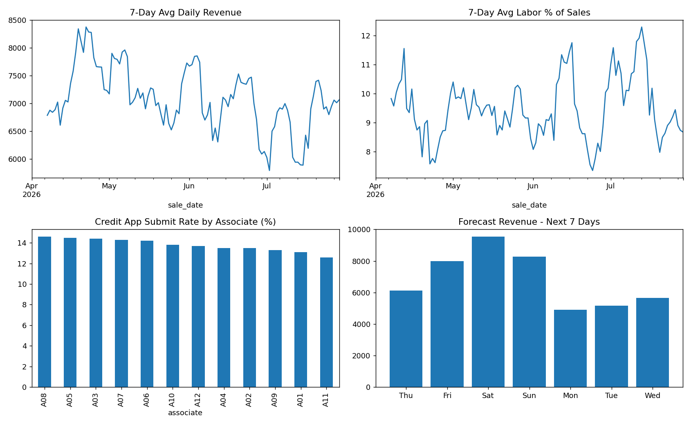

# Retail Operations Analytics

A Python and SQL project I built to practice analyzing retail store data, based on the kinds of reports I work with as a shift manager (sales, labor, cash deposits, credit applications).

Data is synthetic, generated by generate_data.py, so results demonstrate the pipeline rather than real store performance. I used AI tools to help scaffold the code, then reviewed and modified it.

## What it does
- Calculates daily revenue, margin, and labor % of sales with SQL
- Flags days where cash deposits don't match expected cash
- Compares credit application submit rates across associates
- Produces a simple 7-day revenue forecast and a dashboard chart

## Run it
pip install -r requirements.txt
python generate_data.py
python analyze.py

## What I'd improve
I'd replace the synthetic data with a real retail dataset from Kaggle and analyze revenue and units sold for each product to identify bestsellers and slow selling products.
